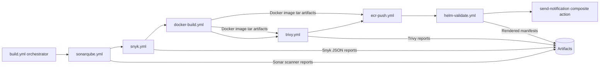
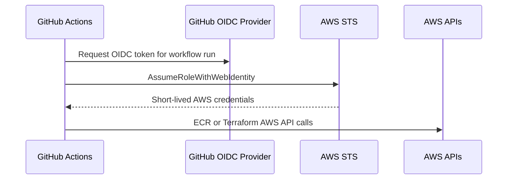
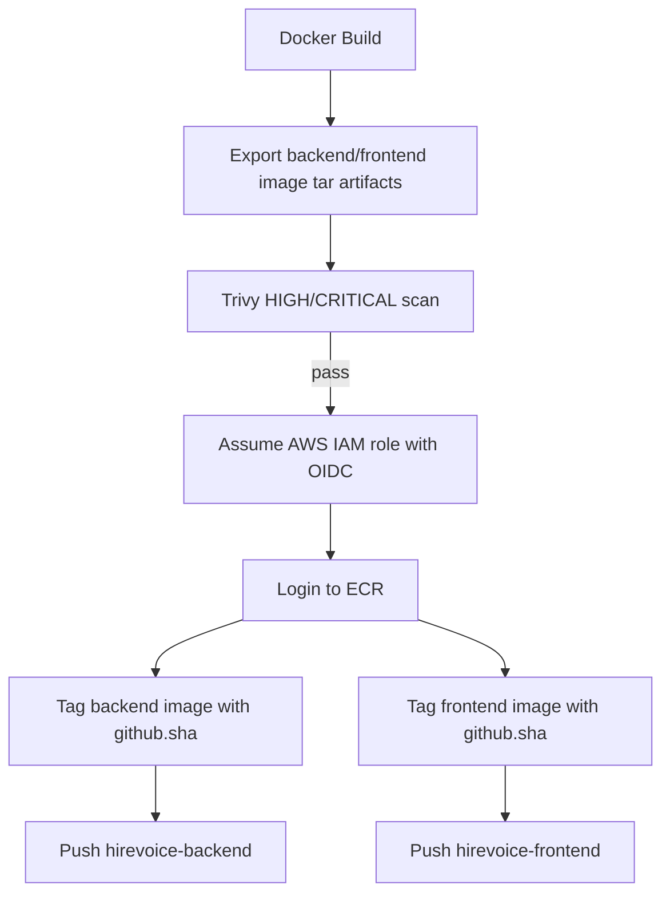

# HireVoice CI/CD Architecture

HireVoice uses a modular GitHub Actions architecture built around `workflow_call`. The top-level `.github/workflows/build.yml` workflow is the CI orchestrator. Each stage is isolated in its own reusable workflow file and is invoked in dependency order.

This implementation does not include ArgoCD and does not create `deploy-argocd.yml`.

## Folder Structure

```text
.github/
├── workflows/
│   ├── build.yml
│   ├── sonarqube.yml
│   ├── snyk.yml
│   ├── docker-build.yml
│   ├── trivy.yml
│   ├── ecr-push.yml
│   ├── helm-validate.yml
│   ├── terraform-plan.yml
│   ├── terraform-apply.yml
│   └── release.yml
└── actions/
    └── send-notification/
        └── action.yml

docs/
└── ci-cd/
    └── ci-architecture.md
```

## Workflow Dependency Diagram



Pull requests run the same security and validation gates but skip ECR publishing.

## workflow_call Architecture

`build.yml` owns triggers, concurrency, high-level permissions, and stage ordering. Reusable workflows own implementation details:

| Stage | Reusable workflow | Purpose |
| --- | --- | --- |
| SonarQube | `sonarqube.yml` | Static analysis and Quality Gate enforcement |
| Snyk | `snyk.yml` | Backend and frontend dependency vulnerability scanning |
| Docker Build | `docker-build.yml` | Backend and frontend Docker image builds using `github.sha` |
| Trivy | `trivy.yml` | Container image vulnerability scanning |
| ECR Push | `ecr-push.yml` | OIDC-based AWS auth and ECR publishing |
| Helm Validation | `helm-validate.yml` | `helm lint`, `helm template`, manifest artifact upload |
| Terraform Plan | `terraform-plan.yml` | `fmt`, `init`, `validate`, `plan`, plan artifact upload |
| Terraform Apply | `terraform-apply.yml` | Manual environment approval, plan reuse, apply, notification |
| Release | `release.yml` | Release metadata, summary, and artifact publishing |

Secrets are passed from orchestrators to reusable workflows with `secrets: inherit`. Required configuration that is not sensitive is passed as workflow inputs from GitHub Variables.

## Security Gates

Mandatory gates are ordered so a failed gate stops later stages:

1. SonarQube Quality Gate fails the pipeline before dependency, build, image scan, or publish stages continue.
2. Snyk scans backend Python dependencies and frontend npm dependencies. Any finding at or above `SNYK_SEVERITY_THRESHOLD` fails the pipeline.
3. Trivy scans the built backend and frontend container images. HIGH and CRITICAL vulnerabilities fail the pipeline.

Images are not pushed to ECR unless SonarQube, Snyk, Docker build, and Trivy all pass. Pull request runs never push images.

## Artifact Flow

| Artifact | Producer | Consumer |
| --- | --- | --- |
| `sonarqube-scanner-report` | `sonarqube.yml` | Audit and troubleshooting |
| `snyk-reports` | `snyk.yml` | Security review |
| `hirevoice-backend-image-<sha>` | `docker-build.yml` | `trivy.yml`, `ecr-push.yml` |
| `hirevoice-frontend-image-<sha>` | `docker-build.yml` | `trivy.yml`, `ecr-push.yml` |
| `trivy-reports` | `trivy.yml` | Security review |
| `helm-rendered-manifests` | `helm-validate.yml` | Deployment review |
| `terraform-plan-<sha>` | `terraform-plan.yml` | `terraform-apply.yml`, infrastructure review |
| `hirevoice-release-<tag>` | `release.yml` | Release audit trail |

The Docker build stage exports images as tar artifacts so Trivy and ECR push operate on the same immutable image produced by CI.

## AWS OIDC Authentication Flow



No static AWS access keys are used. Workflows that access AWS require `id-token: write` and assume the role defined by `AWS_ROLE_TO_ASSUME`.

## ECR Publishing Flow



Target repositories:

| Component | Repository |
| --- | --- |
| Backend | `768979069805.dkr.ecr.us-east-1.amazonaws.com/hirevoice-backend` |
| Frontend | `768979069805.dkr.ecr.us-east-1.amazonaws.com/hirevoice-frontend` |

## GitHub Secrets Required

| Secret | Used by | Purpose |
| --- | --- | --- |
| `SONAR_TOKEN` | `sonarqube.yml` | Authenticates SonarQube scan and Quality Gate checks |
| `SNYK_TOKEN` | `snyk.yml` | Authenticates Snyk dependency scans |
| `SMTP_SERVER` | notification action | Email server hostname |
| `SMTP_PORT` | notification action | Email server port |
| `SMTP_USERNAME` | notification action | Email username |
| `SMTP_PASSWORD` | notification action | Email password |

SMTP values are optional at runtime. If any are missing, the composite action logs the notification summary and skips email delivery.

## GitHub Variables Required

| Variable | Default | Purpose |
| --- | --- | --- |
| `AWS_ACCOUNT_ID` | `768979069805` | ECR registry account and Helm image rendering |
| `AWS_REGION` | `us-east-1` | AWS region |
| `AWS_ROLE_TO_ASSUME` | none | IAM role ARN for GitHub OIDC |
| `BACKEND_ECR_REPOSITORY` | `hirevoice-backend` | Backend ECR repository name |
| `FRONTEND_ECR_REPOSITORY` | `hirevoice-frontend` | Frontend ECR repository name |
| `SONAR_HOST_URL` | none | SonarQube server URL |
| `SONAR_PROJECT_KEY` | none | SonarQube project key |
| `SONAR_PROJECT_NAME` | `HireVoice` | SonarQube project display name |
| `SNYK_SEVERITY_THRESHOLD` | `critical` | Snyk failure threshold |
| `VITE_API_URL` | `/api` | Frontend build-time API URL |
| `NOTIFICATION_EMAIL_TO` | none | Email recipient |
| `NOTIFICATION_EMAIL_FROM` | none | Email sender |

## AWS IAM Role Requirements

The OIDC role used by `AWS_ROLE_TO_ASSUME` should trust the GitHub repository and restrict assumptions to approved branches/environments.

Recommended trust conditions:

```json
{
  "StringEquals": {
    "token.actions.githubusercontent.com:aud": "sts.amazonaws.com"
  },
  "StringLike": {
    "token.actions.githubusercontent.com:sub": [
      "repo:<org-or-user>/<repo>:ref:refs/heads/main",
      "repo:<org-or-user>/<repo>:ref:refs/heads/develop",
      "repo:<org-or-user>/<repo>:pull_request",
      "repo:<org-or-user>/<repo>:environment:production"
    ]
  }
}
```

Minimum permissions for ECR publish:

- `ecr:GetAuthorizationToken`
- `ecr:BatchCheckLayerAvailability`
- `ecr:InitiateLayerUpload`
- `ecr:UploadLayerPart`
- `ecr:CompleteLayerUpload`
- `ecr:PutImage`
- `ecr:DescribeRepositories`

Terraform plan/apply requires least-privilege permissions for managed HireVoice resources across EKS, ECR, RDS, Route53, ACM, Secrets Manager, IAM, VPC/EC2 networking, Kubernetes provider access, and any Terraform state backend if one is later configured.

## Validation Checklist

- `build.yml` calls each stage through `workflow_call`.
- Stage order is enforced with `needs`.
- Security gates stop downstream stages.
- `ecr-push` is skipped for pull requests.
- Docker image artifact outputs from `docker-build.yml` feed `trivy.yml` and `ecr-push.yml`.
- `secrets: inherit` is used where reusable workflows require secrets.
- Artifacts are uploaded for SonarQube, Snyk, Trivy, Helm, Terraform, and release metadata.
- AWS authentication uses OIDC only.

## Risks

- Terraform plan artifacts can contain sensitive values depending on provider output and variable handling.
- Docker image tar artifacts can be large and may increase artifact storage costs.
- Snyk and SonarQube gates depend on external service availability.
- Trivy results can change as vulnerability databases update.
- The Terraform apply workflow relies on GitHub Environment protection for manual approval; configure required reviewers on the `production` environment before use.
- The current Terraform root does not declare a remote backend in the inspected files, so concurrent manual Terraform runs outside CI could create state drift.

## Recommended Next Steps

1. Configure repository variables and secrets listed above.
2. Create and protect the GitHub `production` environment with required reviewers for Terraform apply.
3. Create the AWS OIDC IAM role with branch and environment trust restrictions.
4. Confirm ECR repositories exist: `hirevoice-backend` and `hirevoice-frontend`.
5. Run a pull request validation to verify SonarQube, Snyk, Docker, Trivy, and Helm gates.
6. Run `terraform-plan.yml` with the intended tfvars strategy and review the uploaded plan.
7. Add remote Terraform state locking if it is not already managed outside this repository.
